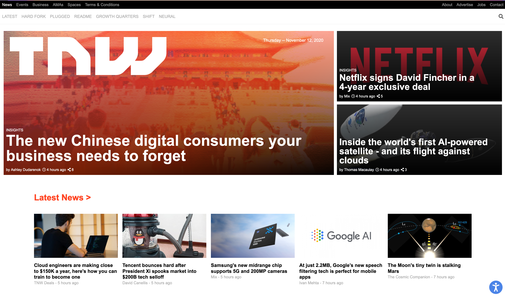

# The Next Web Mockup

## Summary
Mockup of The Next Web's homepage was developed as part of The Odin Project's [Ruby on Rails Curriculum](http://www.theodinproject.com) to practice responsive web design, as well as to experiment more with HTML and CSS.

## The finished product
The mockup can be viewed [here](https://naomiflagg.github.io/tnw-mockup/). Resize your window to view the adaptive display. The Next Web's homepage can be viewed [here](https://thenextweb.com/). Please note that the site's content changes daily, so stories and perhaps page design may have changed since the mockup was created.

## Screenshots

### Web display

### Mobile display
